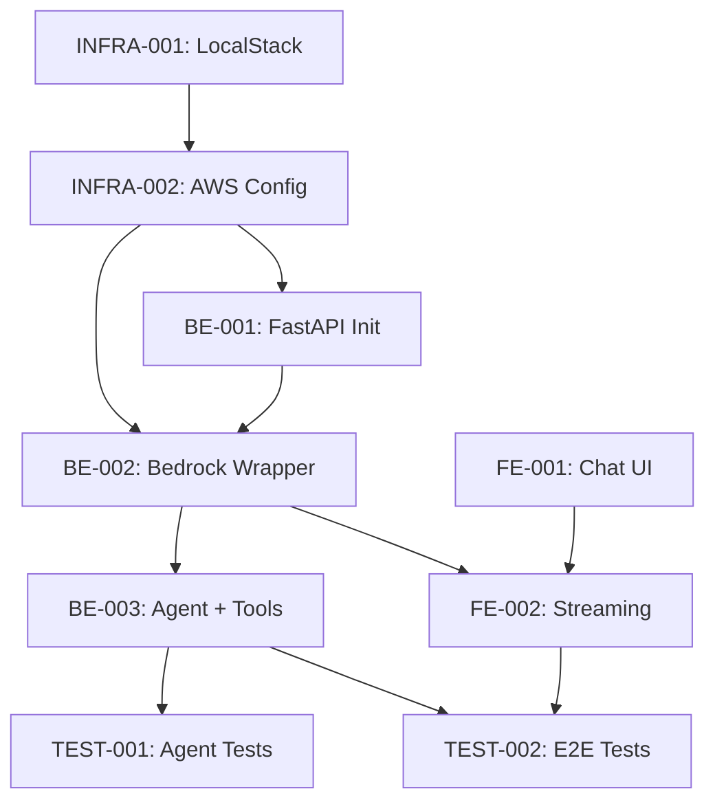

# Sprint 1: Agentic AI Chat Assistant

**Duration**: 2 weeks  
**Team Capacity**: 20 story points  
**Sprint Goal**: Build a functional AI chat assistant that uses LangChain agents with a fine-tuned AWS Bedrock model to answer domain-specific questions.

## Sprint Overview

This example sprint demonstrates how to organize tickets for an agentic AI application, balancing infrastructure, backend, frontend, and testing work.

### Sprint Scope

Build a chat interface where users can ask questions and receive AI-generated responses using:
- A fine-tuned model hosted on AWS Bedrock
- LangChain agents with custom tools
- Next.js chat UI with streaming responses
- LocalStack for local AWS service emulation

### Work Tracking Integration

This sprint uses MCP (Model Context Protocol) integrations for work tracking:

**Notion**: Central documentation and sprint planning database
- Sprint plan synced from markdown to Notion database
- Ticket details with acceptance criteria
- Knowledge base for technical documentation

**Linear**: Issue tracking and workflow management
- Linear issues created from sprint tickets
- Status tracking (TODO → In Progress → Review → Done)
- Team organization (Frontend, Backend, Infrastructure, Testing)

**Discord**: Team communication and notifications
- Real-time ticket status updates
- Daily standup posts using `/standup` command
- Sprint announcements and celebrations
- Quick queries via `/ticket`, `/sprint`, `/velocity` commands

**Integration Flow**:
1. Sprint plan created in `.cursor/plans/sprint_01_agentic_chat.md`
2. Notion Engineer syncs to Notion (Sprint + Tickets databases)
3. Linear Engineer creates Linear issues with proper team assignment
4. Discord Engineer announces sprint start with dedicated thread
5. During sprint: Status changes flow Linear → Notion → Discord
6. End of sprint: Metrics aggregated, retrospective documented in Notion

## Sprint Backlog

### Phase 1: Infrastructure & Setup (Week 1, Days 1-2)

| Ticket | Title | Owner | Points | Dependencies | Status |
|--------|-------|-------|--------|--------------|--------|
| INFRA-001 | Setup LocalStack with Bedrock | AWS Engineer | 3 | None | TODO |
| INFRA-002 | Configure AWS Bedrock Connection | AWS Engineer | 2 | INFRA-001 | TODO |

**Phase 1 Total**: 5 points

### Phase 2: Backend AI Services (Week 1, Days 3-5)

| Ticket | Title | Owner | Points | Dependencies | Status |
|--------|-------|-------|--------|--------------|--------|
| BE-001 | Initialize FastAPI with LangChain | Backend Engineer | 3 | INFRA-002 | TODO |
| BE-002 | Implement Bedrock LLM Wrapper | Backend Engineer | 5 | BE-001, INFRA-002 | TODO |
| BE-003 | Create Agent with Custom Tools | Backend Engineer | 5 | BE-002 | TODO |

**Phase 2 Total**: 13 points

### Phase 3: Frontend Chat Interface (Week 2, Days 1-3)

| Ticket | Title | Owner | Points | Dependencies | Status |
|--------|-------|-------|--------|--------------|--------|
| FE-001 | Create Chat UI Components | Frontend Engineer | 5 | None | TODO |
| FE-002 | Implement Streaming Response | Frontend Engineer | 3 | FE-001, BE-002 | TODO |

**Phase 3 Total**: 8 points

### Phase 4: Testing & Polish (Week 2, Days 4-5)

| Ticket | Title | Owner | Points | Dependencies | Status |
|--------|-------|-------|--------|--------------|--------|
| TEST-001 | Integration Tests for Agent | Test Developer | 3 | BE-003 | TODO |
| TEST-002 | E2E Chat Flow Test | Test Developer | 2 | FE-002, BE-003 | TODO |

**Phase 4 Total**: 5 points

## Sprint Metrics

- **Total Committed**: 26 points
- **Team Capacity**: 20 points
- **Buffer Tickets** (lower priority, will carry over if needed):
  - TEST-002: Can be deferred to next sprint
  - FE-002: Basic polling fallback if streaming is complex

## Dependency Graph

## Sprint Ceremonies

### Sprint Planning (Day 1, 2 hours)
- Review sprint goal and user stories
- Estimate remaining tickets
- Assign tickets to team members
- Identify technical risks
- **Notion Engineer**: Sync sprint plan to Notion database
- **Linear Engineer**: Create Linear issues from tickets
- **Discord Engineer**: Announce sprint start in Discord

### Daily Standup (Every day, 15 min)
- What I completed yesterday
- What I'm working on today
- Any blockers
- **Discord Engineer**: Post standup updates using `/standup` command
- **Notion Engineer**: (Optional) Log standups in Notion

### Sprint Review (Last day, 1 hour)
- Demo working chat interface
- Show agent selecting tools
- Demonstrate streaming responses
- **Notion Engineer**: Update sprint documentation with outcomes
- **Discord Engineer**: Share demo recording/screenshots

### Sprint Retrospective (Last day, 1 hour)
- What went well
- What to improve
- Action items for next sprint
- **Notion Engineer**: Document retrospective insights
- **Linear Engineer**: Create improvement tickets if needed

## Technical Risks

1. **LocalStack Bedrock Limitations**: LocalStack may not fully support all Bedrock features
   - Mitigation: Use mock responses, document differences from production

2. **LangChain Agent Complexity**: Agents can be unpredictable
   - Mitigation: Start with simple tools, add comprehensive logging

3. **Streaming Implementation**: SSE or WebSocket adds complexity
   - Mitigation: Have fallback to polling if streaming is problematic

## Sprint Deliverables

By end of sprint, we should have:
- Working chat interface accessible at `http://localhost:3000/chat`
- Backend API endpoint `/api/chat` that streams responses
- LangChain agent with 2-3 functioning tools
- LocalStack environment for local development
- Test coverage for agent logic
- Documentation for running the application

**Work Tracking**:
- All tickets tracked in Linear with status updates
- Sprint documentation maintained in Notion
- Team updates posted in Discord channels
- Real-time notifications for status changes

## Next Sprint Preview

Sprint 2 will likely include:
- Add conversation memory to agent
- Implement user authentication
- Add more sophisticated tools (web search, database queries)
- Deploy to staging environment with real AWS Bedrock
- Performance optimization and caching
