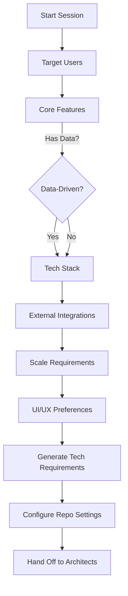

name: Product Manager Agent
overview: Create a Product Manager agent that conducts an interactive conditional questionnaire to help users form product ideas and generate a technical requirements document that feeds into sprint planning.
todos:
  - id: agent-file
    content: Create product-manager.md agent file with role definition and question flow
    status: pending
  - id: question-sequence
    content: Implement conditional question sequence using AskQuestion tool
    status: pending
  - id: tech-req-template
    content: Define technical requirements document template structure
    status: pending
  - id: github-config
    content: Implement script configuration for create-github-issue.sh
    status: pending
  - id: handoff-architect
    content: Define handoff protocol to Chief Architect for validation
    status: pending
  - id: handoff-scrum
    content: Define handoff protocol to Scrum Master for sprint planning
    status: pending
  - id: sprint-structure
    content: Document sprint plan structure with ticket naming and phase organization
    status: pending
isProject: false
---

# Product Manager Agent Implementation

## Agent Structure

Create `[product-manager.md](.cursor/agents/product-manager.md)` following the pattern established in other agent files.

### Agent Responsibilities

The Product Manager agent will:

1. Guide users through a structured product idea formation process
2. Use `AskQuestion` tool for conditional, branching questionnaires
3. Generate a technical requirements document in hybrid format
4. Configure repository settings for GitHub issue creation
5. Hand off to Chief Architect and Scrum Master for implementation planning

### Question Flow Architecture




The agent will implement a numbered sequence using `AskQuestion` with conditional branching based on responses.

## Key Files to Create/Modify

### 1. Product Manager Agent File

`[.cursor/agents/product-manager.md](.cursor/agents/product-manager.md)`

Structure:

- Role definition
- Responsibilities (product discovery, requirements gathering, stakeholder management)
- Question flow implementation using `AskQuestion` tool
- Template structure for technical requirements document
- Handoff protocol to Chief Architect and Scrum Master
- Authority boundaries (what PM can/cannot decide)

### 2. Technical Requirements Template

The agent will generate `[technical-requirements.plan.md](.cursor/plans/technical-requirements.plan.md)` with:

**Frontmatter** (YAML):

- `name`: Product name
- `overview`: One-sentence product description
- `target_users`: User persona(s)
- `problem_statement`: Problem being solved
- `sprint_plan_file`: Reference to sprint plan
- `github_repo`: Configured repository
- `todos`: High-level implementation phases

**Content Sections**:

- User Story (As a [role], I want [feature], so that [benefit])
- Problem Statement
- Target Users & Personas
- Core Features (MVP scope)
- Technology Stack (Frontend, Backend, Database, Infrastructure)
- External Integrations
- Architecture Overview (mermaid diagram)
- Scale & Performance Requirements
- UI/UX Guidelines
- Constraints (Technical, time, resource)
- Definition of Done
- Success Metrics

### 3. Configuration Flow

The agent must configure:

- `[create-github-issue.sh](.cursor/scripts/create-github-issue.sh)` line 9: `_SPRINT_PLAN` variable
- `[create-github-issue.sh](.cursor/scripts/create-github-issue.sh)` line 13: `GITHUB_REPO` variable

This happens after requirements gathering, using either:

- Direct script modification via `StrReplace`
- Interactive questions to get repo name and sprint plan file name

## Handoff Protocol

### To Chief Architect

The PM agent invokes Chief Architect with:

- Path to `technical-requirements.plan.md`
- Request to validate technical feasibility
- Request to update other agent files with project-specific context
- Request to define architecture patterns

### To Scrum Master

The PM agent then invokes Scrum Master in **Plan mode** (using SwitchMode tool if available) with:

- Path to `technical-requirements.plan.md`
- Request to create sprint plan following `[sprint-plan-example.plan.md](.cursor/plans/sprint-plan-example.plan.md)` patterns
- Requirements:
  - Use ticket naming pattern (e.g., FEAT-001, API-001, UI-001)
  - Follow table header format from `table-header.md`
  - Create iterative phases (Week 1: Foundation, Week 2: Core, Week 3+: Features)
  - Generate todos list with ticket IDs
  - Include mermaid dependency graphs
  - Define review checkpoints

## Example Question Sequence

The agent uses numbered conditional questions:

**Q1: Target Users** (Multiple choice)

- Individual developers
- Small teams (2-10)
- Enterprises
- Consumers (B2C)
- Other (specify)

**Q2: Core Features** (Free text with follow-up)

- Describe 3-5 core features
- For each feature, ask priority (Must-have/Nice-to-have)

**Q3: Data-Driven?** (Yes/No)

- If Yes → Q4: Database preferences
- If No → Skip to Q5

**Q4: Technology Stack** (Conditional)

- Frontend: Next.js/React/Vue/Other
- Backend: FastAPI/Express/Other
- Database: PostgreSQL/MongoDB/Other (if data-driven)
- Deployment: Docker/AWS/Local

**Q5: External Integrations** (Multiple select)

- Authentication (Auth0, Clerk, custom)
- Payment (Stripe, PayPal)
- AI/ML (OpenAI, HuggingFace)
- Monitoring (SigNoz, Datadog)
- Other APIs (specify)

**Q6: Scale Requirements** (Multiple choice)

- Prototype (< 100 users)
- Small scale (100-1K users)
- Medium scale (1K-100K users)
- Large scale (100K+ users)

**Q7: UI/UX Preferences** (Multiple choice)

- Minimalist
- Feature-rich dashboard
- Mobile-first
- Accessibility-focused
- Dark mode support

## Sprint Plan Generation

The Scrum Master creates a sprint plan with:

### Ticket Naming Pattern

Based on work type:

- `FEAT-###`: Feature development
- `API-###`: API endpoint work
- `UI-###`: UI components
- `DB-###`: Database/schema work
- `TEST-###`: Testing tasks
- `DOC-###`: Documentation
- `INFRA-###`: Infrastructure/DevOps

### Table Format

Following `table-header.md`:

```
| Ticket | GitHub Issue | Completed | Description | Owner | Depends On | Plan File |
| ------ | ------------ | --------- | ----------- | ----- | ---------- | --------- |
| FEAT-001 | #1 | No | Setup project structure | Backend Engineer | - | .cursor/plans/feat-001_setup.plan.md |
```

### Phase Structure

- **Phase 1: Foundation** (Week 1)
  - Project setup
  - Infrastructure
  - Authentication (if needed)
  - Database schema
- **Phase 2: Core Features** (Week 2)
  - Primary user flows
  - Key API endpoints
  - Essential UI components
- **Phase 3+: Feature Development** (Week 3+)
  - Secondary features
  - Integrations
  - Polish and optimization

### Todos List

Each phase has corresponding todos in frontmatter:

```yaml
todos:
  - id: feat-001
    content: FEAT-001 - Setup project structure
    status: pending
```

## Implementation Notes

1. **Question Storage**: Agent should store responses in memory during session to reference in technical requirements doc
2. **Validation**: After generating technical requirements, agent should ask user to review before proceeding
3. **Iterative Refinement**: Allow user to go back and modify answers
4. **Defaults**: Provide sensible defaults based on existing repo structure (detected from `.cursor/agents/` files)
5. **Script Configuration**: Handle both absolute and relative paths for sprint plan file

## Success Criteria

- Product Manager agent file created with clear responsibilities
- Conditional question flow implemented using `AskQuestion` tool
- Technical requirements document generation with hybrid format
- GitHub issue script configuration automated
- Smooth handoff to Chief Architect (validation) and Scrum Master (sprint planning)
- Sprint plan follows example structure with proper ticket naming and table formatting

