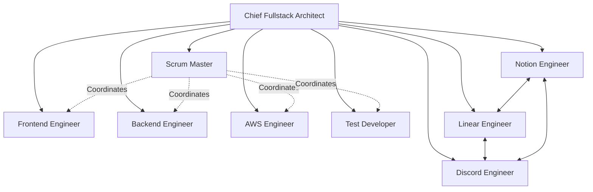

# Agent Coordination Guide

This guide explains how the different agent roles in the cursor-fullstack-template work together to build AI applications.

## Team Structure



## Core Development Agents

### Chief Fullstack Architect
**Role**: Technical leadership and architecture decisions

**Responsibilities**:
- Define system architecture
- Make technology choices
- Review code and designs
- Resolve technical disputes
- Coordinate across all agents

**Works with**: All agents report to Chief Architect

### Scrum Master
**Role**: Facilitate agile process and remove blockers

**Responsibilities**:
- Sprint planning and ceremonies
- Track velocity and capacity
- Remove impediments
- Facilitate team communication

**Works with**: Coordinates all development agents

### Frontend Engineer
**Role**: Next.js/React UI development

**Responsibilities**:
- Build UI components with Shadcn
- Implement API client integration
- Handle client-side state
- Optimize performance

**Works with**: Backend Engineer (API contracts), Test Developer (component tests)

### Backend Engineer
**Role**: Python/FastAPI backend development

**Responsibilities**:
- Build API endpoints
- Implement business logic
- Integrate AI services (LangChain, HuggingFace)
- Manage database models

**Works with**: Frontend Engineer (API contracts), AWS Engineer (deployment), Test Developer (API tests)

### AWS Engineer
**Role**: Cloud infrastructure and DevOps

**Responsibilities**:
- Configure AWS services
- Setup LocalStack for local dev
- Manage Docker and CI/CD
- Implement monitoring (SigNoz, Phoenix)

**Works with**: Backend Engineer (deployment), Test Developer (test environments)

### Test Developer
**Role**: Quality assurance and testing

**Responsibilities**:
- Unit tests (frontend and backend)
- Integration tests
- E2E tests with Playwright
- CI/CD pipeline maintenance

**Works with**: All development agents (test coverage)

## MCP Integration Agents

### Notion Engineer
**Role**: Documentation and knowledge management

**Responsibilities**:
- Maintain Notion databases (Sprints, Tickets, Docs)
- Sync sprint plans from markdown to Notion
- Manage knowledge base
- Handle Notion webhooks

**Works with**: Linear Engineer (ticket sync), Discord Engineer (doc notifications)

**MCP Flow**:
```
Sprint Plan (markdown) → Notion Engineer → Notion Database
└─> Linear Engineer creates issues
└─> Discord Engineer announces sprint
```

### Linear Engineer
**Role**: Issue tracking and workflow

**Responsibilities**:
- Create Linear issues from tickets
- Manage workflow states
- Handle Linear webhooks
- Track dependencies and blockers

**Works with**: Notion Engineer (ticket sync), Discord Engineer (status notifications)

**MCP Flow**:
```
Developer updates status in Linear
└─> Webhook triggers sync
    └─> Linear Engineer updates Notion
    └─> Discord Engineer notifies team
```

### Discord Engineer
**Role**: Team communication and notifications

**Responsibilities**:
- Manage Discord bot and channels
- Send real-time notifications
- Implement slash commands
- Format rich embeds

**Works with**: Notion Engineer (doc updates), Linear Engineer (status changes)

**MCP Flow**:
```
Status Change Event
└─> Discord Engineer receives from coordinator
    └─> Posts to team channel
    └─> Posts to #ticket-updates
    └─> Creates/updates thread if needed
```

## Typical Sprint Workflow

### Sprint Start (Day 1)

1. **Scrum Master** leads sprint planning
2. **Chief Architect** reviews technical readiness
3. **Notion Engineer** syncs sprint plan to Notion database
4. **Linear Engineer** creates Linear issues for all tickets
5. **Discord Engineer** announces sprint start with goals

### Daily Development

1. **Developers** update ticket status in Linear
2. **Linear Engineer** detects webhook, updates Notion
3. **Discord Engineer** posts notification to team channels
4. **Discord Bot** allows quick queries (`/ticket FE-001`)

### Daily Standup

1. **Discord Engineer** sends reminder at standup time
2. Team members use `/standup` command
3. Updates posted to `#daily-standup` channel
4. **Notion Engineer** optionally logs to Notion

### Code Review

1. **Frontend/Backend Engineer** creates PR
2. **Test Developer** ensures tests pass
3. **Chief Architect** reviews architecture
4. **Discord Engineer** notifies team of PR status

### Sprint End

1. **Scrum Master** facilitates review and retrospective
2. **Notion Engineer** updates sprint documentation
3. **Linear Engineer** generates sprint report
4. **Discord Engineer** posts sprint summary

## Integration Coordination

### Work Tracking Coordinator

All three MCP agents coordinate through a central service:

```python
class WorkTrackingCoordinator:
    """Coordinates Notion, Linear, and Discord."""
    
    def __init__(self):
        self.notion = NotionService()
        self.linear = LinearService()
        self.discord = DiscordService()
    
    async def sync_ticket_update(self, ticket_id, updates):
        # Update all platforms
        await self.notion.update_ticket(ticket_id, updates)
        await self.linear.update_issue(ticket_id, updates)
        await self.discord.send_ticket_update(...)
```

### Conflict Resolution

**Source of Truth**:
- **Linear**: Issue status and workflow state
- **Notion**: Documentation and sprint planning
- **Discord**: Notifications only (no persistent state)

**Sync Strategy**:
- Event-driven updates (webhooks)
- Eventually consistent
- Linear writes flow to Notion and Discord
- Notion writes (docs) flow to Discord only

## Communication Patterns

### Synchronous Communication

- **Slack/Discord**: Quick questions, blockers, urgent issues
- **Code Review**: PR comments, inline feedback
- **Pair Programming**: Real-time collaboration

### Asynchronous Communication

- **Notion**: Documentation, RFCs, architecture decisions
- **Linear**: Detailed ticket discussions, requirements
- **Discord Threads**: Long-form technical discussions

### Notifications

- **High Priority**: Discord @mentions
- **Medium Priority**: Discord channel posts
- **Low Priority**: Notion updates (checked periodically)

## Best Practices

### For Development Agents

1. **Update Linear first** - It's the source of truth for status
2. **Document in Notion** - Keep architecture docs updated
3. **Communicate in Discord** - Share progress and blockers
4. **Tag appropriately** - Use ticket IDs in commits and PRs

### For MCP Integration Agents

1. **Handle webhooks idempotently** - Same event may trigger multiple times
2. **Implement retry logic** - APIs may be temporarily unavailable
3. **Rate limit requests** - Respect API limits
4. **Log sync operations** - Debugging requires audit trail
5. **Graceful degradation** - App works if integrations are down

### For Everyone

1. **Single source of truth** - Know where canonical data lives
2. **Clear ownership** - Each agent owns specific domains
3. **Escalate conflicts** - Chief Architect resolves disputes
4. **Document decisions** - Notion for important decisions
5. **Stay synchronized** - Check integrations daily

## Agent Handoffs

### Frontend → Backend
- **Handoff**: API contract definition
- **Medium**: OpenAPI spec in Notion
- **Verification**: Integration tests

### Backend → AWS
- **Handoff**: Deployment requirements
- **Medium**: Dockerfile and infrastructure code
- **Verification**: Successful deployment

### Any → Test Developer
- **Handoff**: Test requirements
- **Medium**: Acceptance criteria in ticket
- **Verification**: Test coverage report

### Any → MCP Agents
- **Handoff**: Work tracking update
- **Medium**: Linear status change
- **Verification**: Synced to Notion and Discord

## Troubleshooting

### Sync Issues

**Problem**: Ticket status out of sync between platforms

**Solution**:
1. Check Linear - it's source of truth
2. Manually trigger sync via coordinator
3. Check webhook logs for failures
4. Verify API credentials

### Communication Gaps

**Problem**: Team not seeing updates

**Solution**:
1. Check Discord bot status
2. Verify channel permissions
3. Test notification flow
4. Review Discord webhook logs

### Documentation Drift

**Problem**: Notion docs outdated

**Solution**:
1. Notion Engineer reviews and updates
2. Add to Definition of Done checklist
3. Link docs to tickets for updates
4. Schedule weekly doc review
